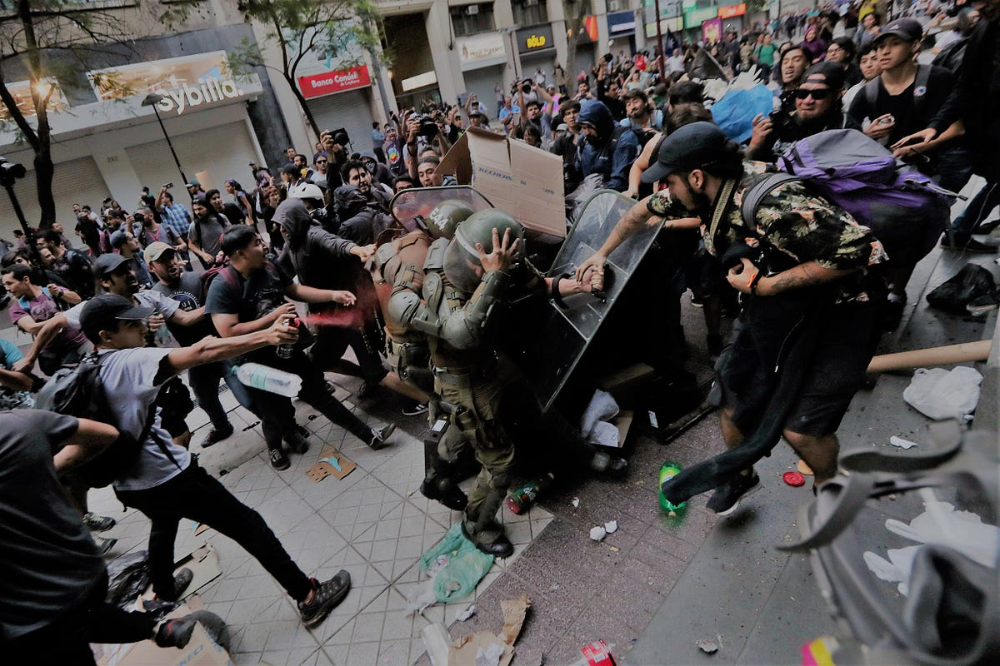
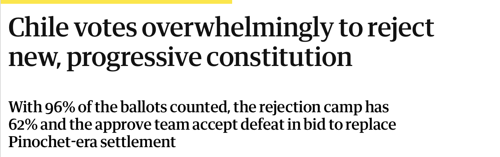
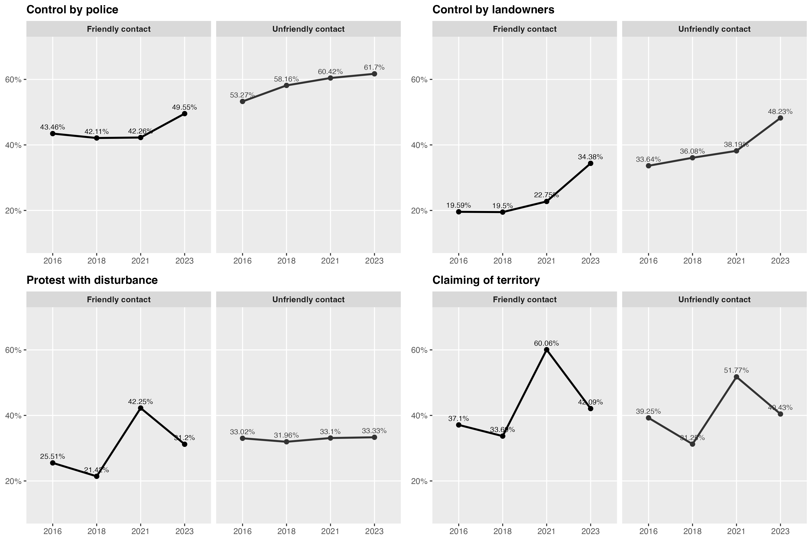
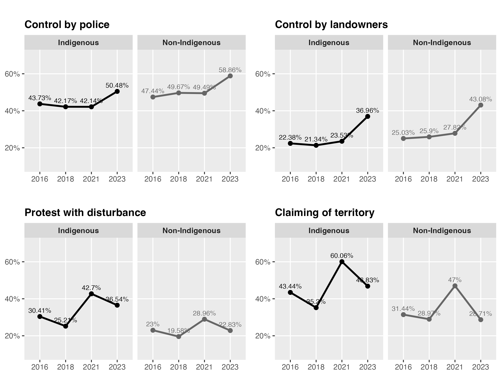
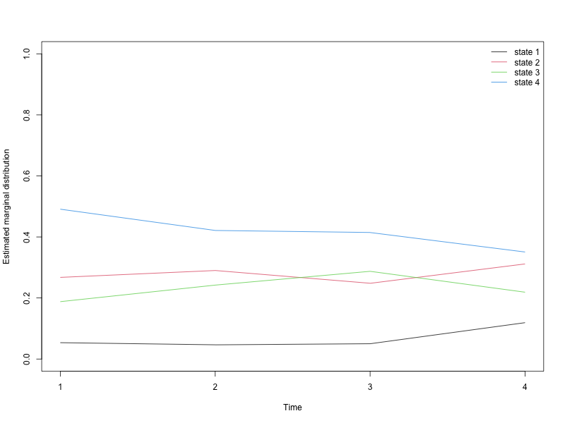
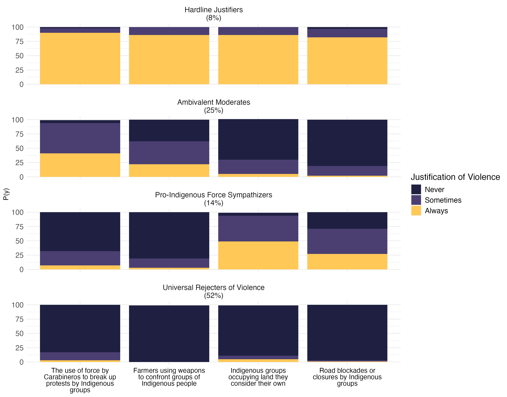
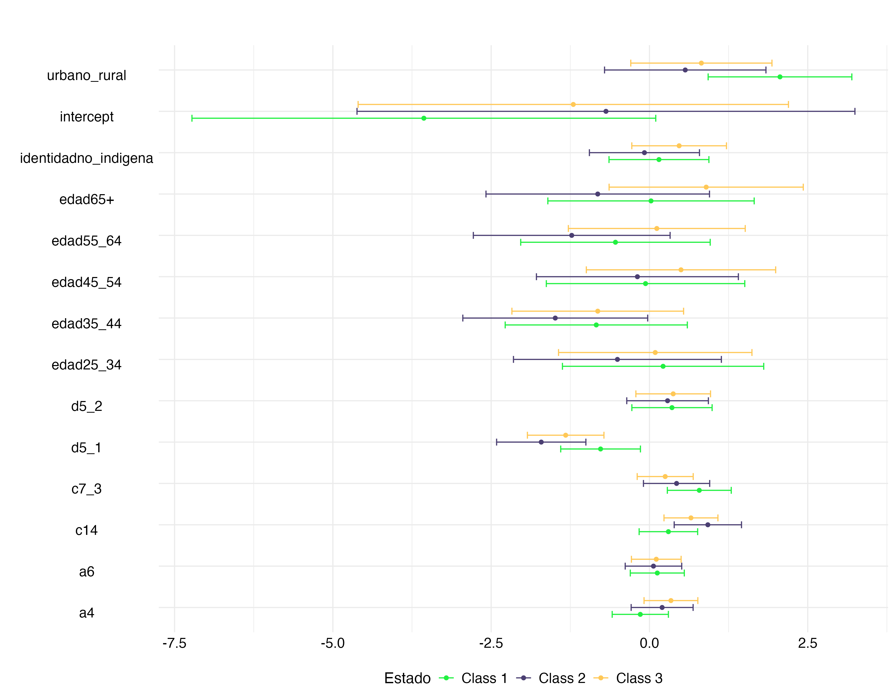
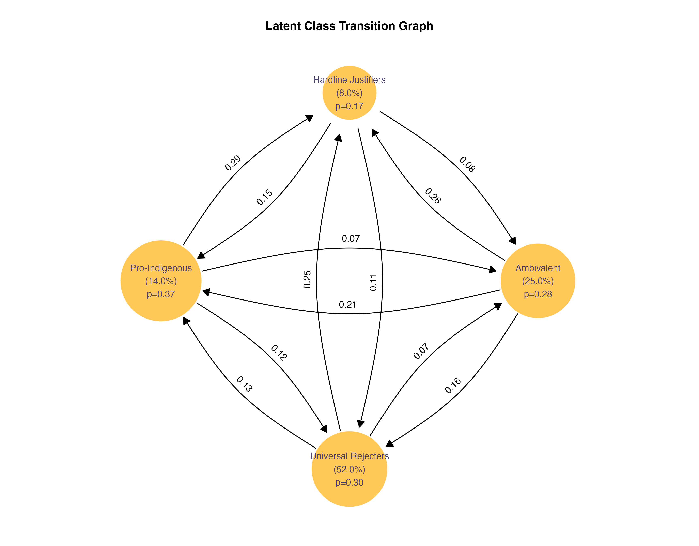
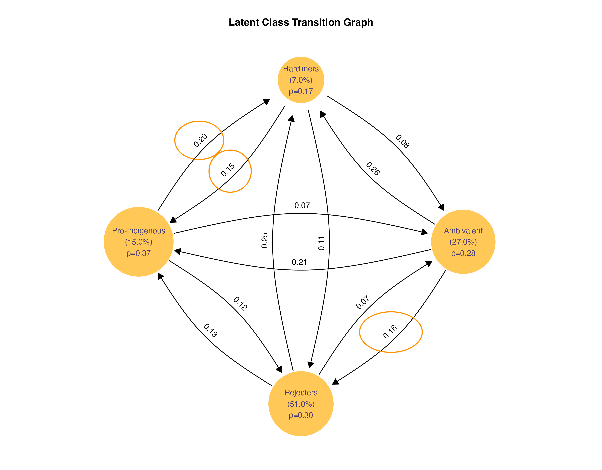

# 🧠 Context, Introduction and State of Art

## Introduction

### Context: Ethnic Conflict and Social Mobilization in Chile

-   Since the mid-2010s, the interethnic conflict in southern Chile—particularly between the state and Mapuche communities—has become increasingly visible and contested.\
-   This period has witnessed a rise in land-related actions by Indigenous organizations, the intensification of militarized responses by state forces, and high-profile cases of police violence against Indigenous individuals.

{fig-align="center" width="493"}

## Introduction

### Context: Ethnic Conflict and Social Mobilization in Chile

-   The 2019 social uprising amplified widespread demands for justice, dignity, and structural change. In response, Chile established a Constitutional Convention to draft a new constitution that addressed issues like inequality, political exclusion, and the historical marginalization of Indigenous peoples. During this process, Indigenous claims—especially from the Mapuche—gained visibility and were embraced as part of a broader struggle against systemic injustice.

<!-- -->

-   However, the 2022 plebiscite marked a turning point. Although the draft constitution included symbolic and institutional recognition of Indigenous rights, such as a plurinational state, it was rejected by a majority of voters. Some critics viewed the proposal as overly focused on Indigenous issues, reflecting broader societal divisions over recognition and autonomy.

{fig-align="center" width="631"}

## Introduction

### Consequences: Polarization and Attitudes Toward Intergroup Violence

-   These developments have contributed to a climate of mistrust, political polarization, and selective legitimization of violence.\
-   Public discourse has grown increasingly divided over the use of force—both by the state and Indigenous actors—raising concerns about the factors that shape these views.\
-   This study investigates the social and psychological foundations of public attitudes toward intergroup violence, exploring how people justify violence depending on the actor, context, and perceived legitimacy.

{fig-align="center"}

## Research Aims and Analytical Framework

This study seeks to understand how the Chilean public justifies intergroup violence in the context of Indigenous–state conflict. Specifically, it asks:

-   Under what conditions do people justify the use of violence by police forces or Indigenous actors?
-   What role do perceptions of **procedural justice**, **group identification**, and **positive intergroup contact** play in shaping these attitudes?

To address these questions, we use **Latent Class Analysis (LCA)** to identify attitudinal profiles across the population and **multinomial regression** to examine how individual characteristics predict class membership.

By focusing on Chile as a case of contested multiculturalism and political transition, the study offers insights into broader dynamics of legitimacy, resistance, and social cohesion in multiethnic democracies.

## Theoretical Approach

**Contact Theory**: Posits that intergroup contact under favorable conditions (e.g., equal status, cooperation, institutional support) can reduce prejudice and intergroup hostility [((Allport, 1954))]{style="color:#1f77b4;"}. Applied here to assess how the quality of contact with Indigenous peoples affects support for violence.

**Social Identity Theory**: Suggests that individuals derive part of their identity from group membership, leading to in-group favoritism and potential out-group discrimination [((Tajfel & Turner, 1979))]{style="color:#1f77b4;"}. Relevant for understanding how ethnic identification shapes attitudes toward intergroup conflict.

**Procedural Justice Theory**: Emphasizes the importance of fair and respectful treatment by authorities in fostering legitimacy and compliance [((Tyler, 2006))]{style="color:#1f77b4;"}. In the intercultural context, perceptions of procedural fairness may influence whether violence by or against the state is seen as justified.

## State of the Art

Violence has been studied as a form of control, resistance, or transformation, depending on the actor and the context. Recent contributions from political psychology highlight that informal social norms shape what is perceived as acceptable in conflict scenarios [(González 2024)]{style="color:#1f77b4;"}.. These norms influence collective attitudes and behaviors beyond what is formally regulated [(Huesmann & Guerra 1997]{style="color:#1f77b4;"}; [Markowitz 2001]{style="color:#1f77b4;"}; [Castano 2008)]{style="color:#1f77b4;"}.

In the case of minority groups, structural discrimination, unequal treatment by the state, and a lack of institutional recognition foster perceptions of illegitimacy and, in some cases, justify defensive or transformative forms of violence. This pattern has been documented in contexts such as the U.S., the U.K., and Chile [(Gau & Brunson 2015]{style="color:#1f77b4;"}; [Gerber et al. 2017]{style="color:#1f77b4;"}; [Bradford, Milani & Jackson 2017]{style="color:#1f77b4;"}; [Murphy et al. 2017)]{style="color:#1f77b4;"}.

A recent study by [Gerber et al. 2023]{style="color:#1f77b4;"}. examined violence both from and against protesters in Chile, using measures of procedural justice and social identity. Our study adopts a similar approach but focuses on the conflict between Indigenous peoples and the state, drawing on a broader longitudinal panel and applying latent class modeling to analyze evolving attitudes over time.

# 🚩 Methods

## Methods

### Data

The data source is the *Encuesta Longitudinal de Relaciones Interculturales* (ELRI), a biannual panel study conducted between 2016 and 2023, comprising four waves (2016, 2018, 2021, and 2023). The survey employed a "mirror sample" design, meaning that Indigenous respondents were oversampled, and non-Indigenous Chileans were interviewed in the same residential blocks.

The survey consists of four mirror samples:

-   Northern Andean Indigenous Sample (Diaguita, Quechua)

-   Non-Indigenous Chilean Sample (North)

-   Mapuche Indigenous Sample

-   Non-Indigenous Chilean Sample (Central–South)

For this research we used: Indigenous and non indigeneous (732 Indigenous and 500 non indigenous).

## Methods

### First step: Latent Class Analysis

**Latent Class Analysis (LCA)** is a statistical method used to identify unobserved (or “latent”) subgroups within a population based on individuals’ responses to a set of observed variables. Rather than assuming all individuals are the same or vary along a single continuum, LCA assumes that there are **qualitatively different profiles or classes** of people that explain patterns in their attitudes or behaviors.

In this study, LCA is useful for identifying **distinct attitudinal profiles regarding the justification of intergroup violence**.

### Second step: Multinomial Regression

To explore what factors predict membership in each latent class, we estimate a **multinomial logistic regression model**. This approach calculates the probability that a respondent belongs to one of the latent classes. Key predictors include , **Ethnic self-identification** , **Frequency and quality of intergroup contact**, **Social Identity** and **Procedural justice**.

$$
\log\left(\frac{P(Y_i = k)}{P(Y_i = \text{reference})}\right) = \beta_{0k} + \beta_{1k}X_{1i} + \beta_{2k}X_{2i} + \cdots + \beta_{pk}X_{pi}
$$

## Methods

### Construction Latent Class

| **Item**                                                                                                                                                          | **Concept**                 |
|-------------------------------------------------------|-----------------|
| To what extent do you believe that... the use of force by *Carabineros \[Police Chile\]* \[Police Chile\] to disperse protests by Indigenous groups is justified? | Violence for social control |
| To what extent do you believe that... farmers using firearms to confront Indigenous groups is justified?                                                          | Violence for social control |
| To what extent do you believe that... Indigenous groups occupying land they consider their own is justified?                                                      | Violence for social change  |
| To what extent do you believe that... Indigenous groups blocking roads or highways is justified?                                                                  | Violence for social change  |

## Methods

### Independant variables

::: {style="font-size: 0.9em; overflow-x: auto;"}
| Variable                                                              | Description                                                        | Psychosocial Concept                           | Key Theoretical References                                                    |
|------------------|------------------|------------------|--------------------|
| Identification with Indigenous Peoples                                | Degree of subjective identification with Indigenous groups         | Ingroup identification (subordinate group)     | Tajfel & Turner (1979); Gaertner & Dovidio (2000); Simon & Klandermans (2001) |
| Identification with Chile                                             | Degree of subjective identification with the Chilean nation        | Superordinate/national identification          | Brewer (1999); Roccas & Brewer (2002); Reicher & Hopkins (2001)               |
| Positive contact with non-Indigenous Chileans                         | Perceived friendliness when interacting with non-Indigenous people | Intergroup contact quality                     | Allport (1954); Pettigrew & Tropp (2006); Paolini et al. (2004)               |
| Positive contact with Indigenous Chileans                             | Perceived friendliness when interacting with Indigenous people     | Intergroup contact quality (reverse direction) | Pettigrew (1998); Dixon et al. (2005); Saguy et al. (2009)                    |
| Carabineros \[Police Chile\] treat Indigenous people with respect     | Perceived fairness in police treatment of Indigenous communities   | Procedural justice; institutional trust        | Tyler (2006); Sunshine & Tyler (2003); Lind & Tyler (1988)                    |
| Carabineros \[Police Chile\] treat non-Indigenous people with respect | Perceived fairness in police treatment of non-Indigenous           | Procedural justice; institutional trust        | Tyler (2006); Sunshine & Tyler (2003); Lind & Tyler (1988)                    |
:::

# 📊 Results

## Results

### Descriptive statistics

{fig-align="center"}

## Results

### Descriptive statistics

{fig-align="center"}

## Results

### Latent class

{fig-align="center"}

## Results: Latent Classes

::: columns
::: {.column width="70%"}
{width="105%"}
:::

::: {.column width="30%"}
**Ambivalent Moderates (27%)**\
Hold mixed views depending on the scenario.

**Hardline Justifiers (7%)**\
Consistently justify the use of violence across all situations.

**Pro-Indigenous Force Sympathizers (15%)**\
More likely to justify violence when exercised by Indigenous groups.

**Universal Rejecters of Violence (51%)**\
Reject all forms of violence regardless of the actor or context.
:::
:::

## Results

### Memberpish predictors

{fig-align="center"}

## Results : Interpretation of Latent Classes

The latent class analysis identified four distinct groups based on individuals’ patterns of justification of intergroup violence. Below we describe the main features of each class, integrating regression results to clarify their attitudinal profiles.

### **Class 1 – Ambivalent Moderates (27%)**

This group holds mixed or context-dependent attitudes toward intergroup violence. They are significantly **less likely to support violence** if they report **positive contact with both Indigenous and non-Indigenous people**:

$$
\text{Positive Contact (Indigenous)} \Rightarrow \beta = -0.44,\ \text{OR} = 0.64
$$

$$
\text{Positive Contact (Non-Indigenous)} \Rightarrow \beta = -0.77,\ \text{OR} = 0.46
$$

This suggests that interpersonal ties reduce approval of violence. Their ambiguity may reflect a general moral discomfort with violence, yet an openness to consider it depending on context.

## Results : Interpretation of Latent Classes

The latent class analysis identified four distinct groups based on individuals’ patterns of justification of intergroup violence. Below we describe the main features of each class, integrating regression results to clarify their attitudinal profiles.

### **Class 2 – Hardline Justifiers (7%)**

This small group consistently justifies violence across scenarios. They are **more likely** to belong to this class when reporting **positive contact with Indigenous people**:

$$
\beta = 0.46,\ \text{OR} = 1.59
$$

However, they are **less likely** to be in this class if they **respect Indigenous people** or **live in rural areas**:

$$
\text{Respect (Indigenous)} \Rightarrow \beta = -1.33,\ \text{OR} = 0.27
$$

$$
\text{Rural Residence} \Rightarrow \beta = -0.85,\ \text{OR} = 0.43
$$

This pattern may reflect a politicized solidarity that is distinct from interpersonal or moral respect.

## Results : Interpretation of Latent Classes

The latent class analysis identified four distinct groups based on individuals’ patterns of justification of intergroup violence. Below we describe the main features of each class, integrating regression results to clarify their attitudinal profiles.

### **Class 3 – Pro-Indigenous Force Sympathizers (15%)**

This group selectively justifies violence when it is exercised by Indigenous actors. They are more likely to be **Indigenous themselves**:

$$
\beta = 0.45,\ \text{OR} = 1.57
$$

Conversely, **positive contact with non-Indigenous people** and **respect for Indigenous people** both decrease the probability of belonging to this class:

$$
\text{Positive Contact (Non-Indigenous)} \Rightarrow \beta = -0.44,\ \text{OR} = 0.65
$$

$$
\text{Respect (Indigenous)} \Rightarrow \beta = -0.61,\ \text{OR} = 0.54
$$

This suggests that symbolic alignment—rather than interpersonal relationships—drives support for Indigenous-led force.

## Results : Interpretation of Latent Classes

The latent class analysis identified four distinct groups based on individuals’ patterns of justification of intergroup violence. Below we describe the main features of each class, integrating regression results to clarify their attitudinal profiles.

### **Class 4 – Universal Rejecters of Violence (51%)**

Although Class 4 is the reference category and not directly modeled in the regression, we can infer its profile based on variables that **reduce the likelihood of belonging to other classes**. Individuals who are less likely to be in Classes 1, 2, or 3 are, by implication, more likely to fall within this residual non-violent group.

-   **Positive contact with both Indigenous and non-Indigenous people**, since:
    -   ↓ Class 1 membership with positive contact with Indigenous people\
    -   ↓ Class 1 and Class 3 membership with positive contact with non-Indigenous people\
-   **Respectful attitudes toward Indigenous people**, since:
    -   ↓ Class 2 and Class 3 membership with respectful treatment of Indigenous people

These results suggest that people with inclusive interpersonal experiences and a respectful orientation toward Indigenous groups are more likely to reject all forms of intergroup violence.

## Results

### Probability to transitions

:::{.columns}

::: {.column width="65%"}

:::

::: {.column width="35%"}

- Our longitudinal model also tracks change.
- This graph shows the probability of transi-tio-ning from one attitudinal class to another. 
- While some profiles remain relatively stable, overall we observe a considerable degree of volatility 

:::

:::

## Results

### Probability to transitions

{fig-align="center"}

## Conclusions

**The findings suggest that attitudes toward intergroup violence are not monolithic but structured into distinct latent profiles**. The most stable and prevalent group—**Universal Rejecters of Violence**—reflects a widespread normative commitment to non-violence. However, the existence of more ambivalent and context-dependent classes points to underlying tensions in how individuals interpret intergroup conflict.

Positive intergroup contact—particularly with Indigenous and non-Indigenous groups—reduces support for violent justification, in line with **Contact Theory**. Additionally, perceptions of respectful treatment toward Indigenous peoples are associated with lower odds of justifying violence, supporting the role of **Procedural Justice** in shaping legitimacy.

The fluidity of certain classes, especially the **Hardline Justifiers**, reveals that attitudes toward violence can shift over time. This aligns with **Social Identity Theory**, where changing perceptions of group status and fairness can reshape how conflict is evaluated.

# Thank you!

You can see the presentation here: [https://matdknu.github.io/presentations/ispp/conflict_violence/presentacion_violence.html](https://matdknu.github.io/presentations/ispp/conflict_violence/presentacion_violence.html#/title-slide)

m.deneken\[at\]uc.cl
