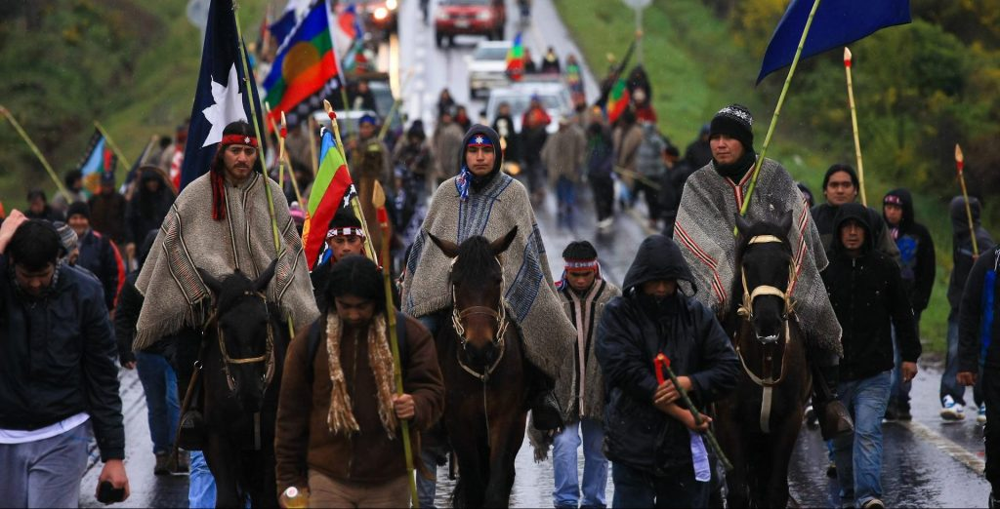
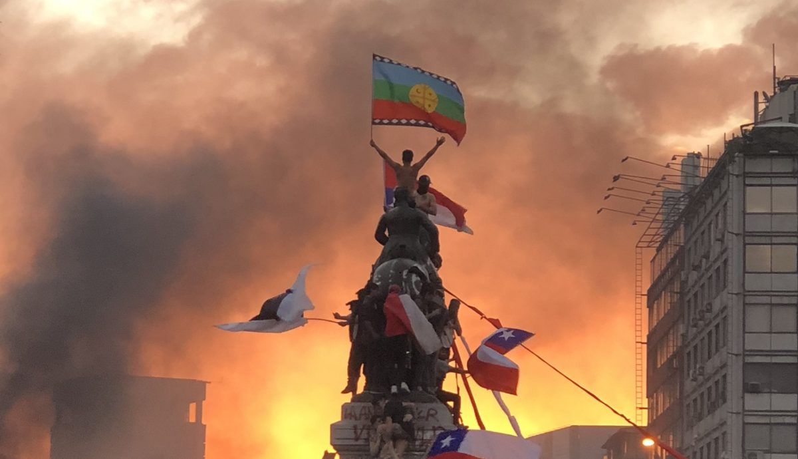

## Introduction

#### **1. Persistence and Transformation of Ethnic Conflicts in the 21st Century**

-   Despite democratic progress, conflicts between states and ethnic minorities continue across different regions.

-   Violence has evolved: from colonial-style repression to modern expressions shaped by institutional frameworks and political dynamics.

#### **2. The Ambivalent Role of the State**

-   Coexistence of repressive policies and absence of active cultural protection measures.

-   The state functions both as an agent of integration and a source of ongoing marginalization.

#### **3. Intergroup Violence: A Social Psychology Perspective**

-   Defined as violence directed at members of an outgroup.

-   Literature highlights that the form of violence depends on specific intergroup dynamics and contexts.

-   Violence may be used by majorities to maintain control or by minorities to resist oppression and advocate for change.

## Introduction: Chilean context

Since the mid-2010s, the interethnic conflict in southern Chile has gained greater visibility and complexity. This period has been marked by a series of developments, including the intensification of land-related actions by Indigenous organizations, the increased use of militarized strategies by the state, emblematic cases of police violence against Indigenous individuals, and unsuccessful institutional attempts to recognize Indigenous peoples in the Constitution. Together, these events have contributed to an atmosphere of mutual distrust, polarization, and selective legitimization of violence.

{fig-align="center"}

## Introduction: Demands in the Context of the 2019 Uprising and the Constitutional Process

**2019 Social Uprising**: Sparked widespread demands for dignity, justice, and structural change in Chilean society.

**Increased Solidarity with Indigenous Causes**: During the uprising, Indigenous demands—especially those of the Mapuche—gained broader legitimacy and were seen as part of a shared struggle against historical and systemic injustice.

**Constitutional Recognition**: The Constitutional Convention proposed a plurinational state, collective Indigenous rights, and reserved seats for Indigenous representatives.

**Plebiscite Rejection (2022)**: The majority vote against the proposed Constitution marked a turning point. While some interpreted it as rejection of the overall process, it also signaled limited public support for structural recognition of Indigenous autonomy.

**Symbolic Rise, Political Limits**: Despite unprecedented visibility and symbolic inclusion, Indigenous claims faced clear boundaries in terms of political acceptance and societal consensus.

## Introduction: Research aims

-   **Understand public attitudes** toward intergroup violence in the context of Indigenous–state conflict in Chile.\
-   **Identify the conditions** under which people justify violence — whether committed by police forces or Indigenous actors.\
-   **Explore the role** of perceived procedural justice, group identification, and solidarity with Indigenous causes.\
-   **Use latent class analysis** to uncover distinct attitudinal profiles within the population.

{fig-align="center" width="524"}

## Literatura review

## Methods

### Data

The data source is the *Encuesta Longitudinal de Relaciones Interculturales* (ELRI), a biannual panel study conducted between 2016 and 2023, comprising four waves (2016, 2018, 2021, and 2023). The survey employed a "mirror sample" design, meaning that Indigenous respondents were oversampled, and non-Indigenous Chileans were interviewed in the same residential blocks.

The survey consists of four mirror samples:

-   Northern Andean Indigenous Sample (Diaguita, Quechua)

-   Non-Indigenous Chilean Sample (North)

-   Mapuche Indigenous Sample

-   Non-Indigenous Chilean Sample (Central–South)

### Statistical

## Methods

**Latent Class Analysis (LCA)** is a statistical method used to identify unobserved (or “latent”) subgroups within a population based on individuals’ responses to a set of observed variables. Rather than assuming all individuals are the same or vary along a single continuum, LCA assumes that there are **qualitatively different profiles or classes** of people that explain patterns in their attitudes or behaviors.

In this study, LCA is useful for identifying **distinct attitudinal profiles regarding the justification of intergroup violence**.

### Construction Latent Class

| **Item**                                                                                                                        | **Concept**                 |
|---------------------------------------------------|---------------------|
| To what extent do you believe that... the use of force by *Carabineros* to disperse protests by Indigenous groups is justified? | Violence for social control |
| To what extent do you believe that... farmers using firearms to confront Indigenous groups is justified?                        | Violence for social control |
| To what extent do you believe that... Indigenous groups occupying land they consider their own is justified?                    | Violence for social change  |
| To what extent do you believe that... Indigenous groups blocking roads or highways is justified?                                | Violence for social change  |

## Methods

### Independant variables

::: {style="font-size: 0.9em; overflow-x: auto;"}
| Variable                                                | Description                                                                       | Psychosocial Concept                                     | Key Theoretical References                                                    |
|------------------|-------------------|------------------|------------------|
| Identification with Indigenous Peoples                  | Degree of subjective identification with Indigenous groups                        | Ingroup identification (subordinate group)               | Tajfel & Turner (1979); Gaertner & Dovidio (2000); Simon & Klandermans (2001) |
| Identification with Chile                               | Degree of subjective identification with the Chilean nation                       | Superordinate/national identification                    | Brewer (1999); Roccas & Brewer (2002); Reicher & Hopkins (2001)               |
| Positive contact with non-Indigenous Chileans           | Perceived friendliness when interacting with non-Indigenous people                | Intergroup contact quality                               | Allport (1954); Pettigrew & Tropp (2006); Paolini et al. (2004)               |
| Positive contact with Indigenous Chileans               | Perceived friendliness when interacting with Indigenous people                    | Intergroup contact quality (reverse direction)           | Pettigrew (1998); Dixon et al. (2005); Saguy et al. (2009)                    |
| Carabineros treat Indigenous people with respect        | Perceived fairness in police treatment of Indigenous communities                  | Procedural justice; institutional trust                  | Tyler (2006); Sunshine & Tyler (2003); Lind & Tyler (1988)                    |
| Carabineros favor non-Indigenous over Indigenous people | Perception that police protect non-Indigenous interests more than Indigenous ones | Group-based discrimination; perceived institutional bias | Sidanius & Pratto (1999); Blumer (1958); Jost & Banaji (1994)                 |
| Authoritarianism (RWA items)                            | Agreement with statements emphasizing obedience, tradition, and social order      | Right-Wing Authoritarianism                              | Altemeyer (1981, 1996); Duckitt (2001); Feldman (2003)                        |
| Support for democracy (democratic values)               | Agreement with statements defending civil rights and diversity                    | Democratic values; tolerance                             | Sullivan et al. (1982); McClosky & Brill (1983); Gibson (2006)                |
:::

## Results

### Descriptive statistics

{fig-align="center"}

## Results

\[Another graph\]

## Results

### Latent class

{fig-align="center"}

## Results: Latent class

## Results: Latent class

<table>
  <tr>
    <td style="width:80%; vertical-align:top;">
      
    </td>
    <td style="width:20%; vertical-align:top; padding-left:20px;">
      
**Hardline Justifiers (8%)**  
Consistently justify the use of violence in all scenarios. 

**Ambivalent Moderates (25%)**  
Hold mixed positions depending on the context. They sometimes justify violence, suggesting moral ambivalence to conflict.

**Pro-Indigenous Force Sympathizers (14%)**  
More likely to justify violence when exercised by Indigenous groups. 

**Universal Rejecters of Violence (52%)**  
Reject all forms of violence regardless of the actor. 

    </td>
  </tr>
</table>

## Results

### Memberpish predictors

{fig-align="center"}

## Results

### Probability to transitions

{fig-align="center"}

## Conclusions
